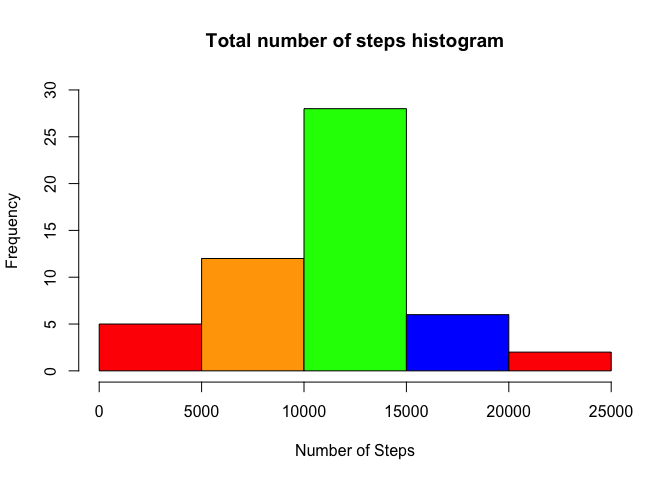
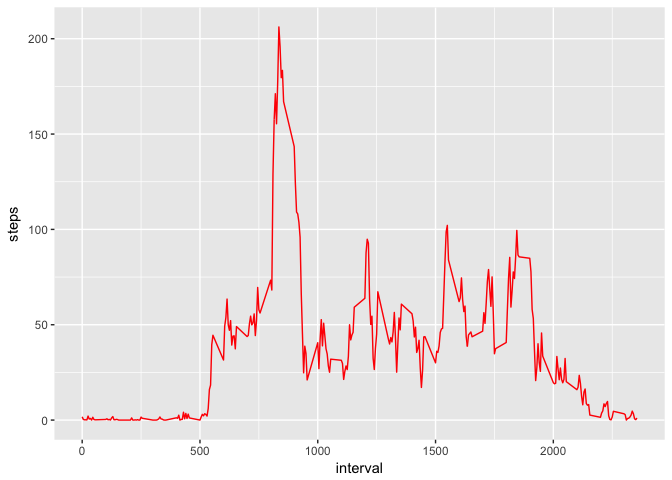
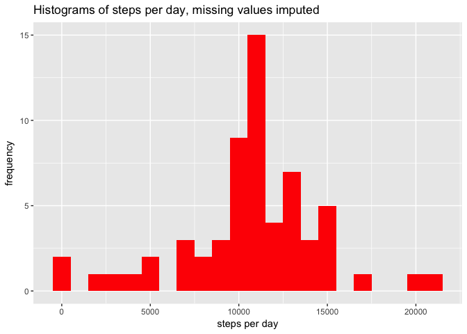
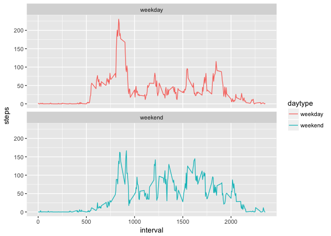

# Reproducible Research: Peer Assessment 1

## Ayo Johnson
May 8, 2017

#Introduction
In this exercise we analyse two months worth of data generated by the activity (number of steps) of an anonymous individual.
Number of steps was collected in five minute intervals throughout the day.

Note: This report was generated using RStudio (v 1.0.143) and the included knitr package. Code and results of computations are echoed by default.
Markdown and html documents are created by default.


## Loading and preprocessing the data
1. Load the data (i.e. read.csv())

2. Process/transform the data (if necessary) into a format suitable for your analysis
- First let's load the data in and take a look at it

```r
ActivityData <- read.csv(unzip("activity.zip"))
head(ActivityData)
```

```
##   steps       date interval
## 1    NA 2012-10-01        0
## 2    NA 2012-10-01        5
## 3    NA 2012-10-01       10
## 4    NA 2012-10-01       15
## 5    NA 2012-10-01       20
## 6    NA 2012-10-01       25
```

```r
tail(ActivityData)
```

```
##       steps       date interval
## 17563    NA 2012-11-30     2330
## 17564    NA 2012-11-30     2335
## 17565    NA 2012-11-30     2340
## 17566    NA 2012-11-30     2345
## 17567    NA 2012-11-30     2350
## 17568    NA 2012-11-30     2355
```

```r
str(ActivityData)
```

```
## 'data.frame':	17568 obs. of  3 variables:
##  $ steps   : int  NA NA NA NA NA NA NA NA NA NA ...
##  $ date    : Factor w/ 61 levels "2012-10-01","2012-10-02",..: 1 1 1 1 1 1 1 1 1 1 ...
##  $ interval: int  0 5 10 15 20 25 30 35 40 45 ...
```

```r
summary(ActivityData)
```

```
##      steps                date          interval     
##  Min.   :  0.00   2012-10-01:  288   Min.   :   0.0  
##  1st Qu.:  0.00   2012-10-02:  288   1st Qu.: 588.8  
##  Median :  0.00   2012-10-03:  288   Median :1177.5  
##  Mean   : 37.38   2012-10-04:  288   Mean   :1177.5  
##  3rd Qu.: 12.00   2012-10-05:  288   3rd Qu.:1766.2  
##  Max.   :806.00   2012-10-06:  288   Max.   :2355.0  
##  NA's   :2304     (Other)   :15840
```
We note that the date variable is a factor, so we'll change it to date format using the package lubridate.
And check structure for certainty it worked.


```r
library(lubridate)
```

```
## 
## Attaching package: 'lubridate'
```

```
## The following object is masked from 'package:base':
## 
##     date
```

```r
ActivityData$date <- ymd(ActivityData$date)
str(ActivityData)
```

```
## 'data.frame':	17568 obs. of  3 variables:
##  $ steps   : int  NA NA NA NA NA NA NA NA NA NA ...
##  $ date    : Date, format: "2012-10-01" "2012-10-01" ...
##  $ interval: int  0 5 10 15 20 25 30 35 40 45 ...
```

## What is mean total number of steps taken per day?
Ignoring missing data:

1. Make a histogram of the total number of steps taken each day

2. Calculate and report the mean and median total number of steps taken per day
- First, we will remove missing data

```r
newData <- na.omit(ActivityData)
```

- For this we'll use the dplyr package
- And ensure the data is arranged by date

```r
library(dplyr)
```

```
## 
## Attaching package: 'dplyr'
```

```
## The following objects are masked from 'package:lubridate':
## 
##     intersect, setdiff, union
```

```
## The following objects are masked from 'package:stats':
## 
##     filter, lag
```

```
## The following objects are masked from 'package:base':
## 
##     intersect, setdiff, setequal, union
```

```r
newData <- arrange(newData, date)
dates <- group_by(newData, date)
head(dates)
```

```
## Source: local data frame [6 x 3]
## Groups: date [1]
## 
##   steps       date interval
##   <int>     <date>    <int>
## 1     0 2012-10-02        0
## 2     0 2012-10-02        5
## 3     0 2012-10-02       10
## 4     0 2012-10-02       15
## 5     0 2012-10-02       20
## 6     0 2012-10-02       25
```

```r
tail(dates)
```

```
## Source: local data frame [6 x 3]
## Groups: date [1]
## 
##   steps       date interval
##   <int>     <date>    <int>
## 1     0 2012-11-29     2330
## 2     0 2012-11-29     2335
## 3     0 2012-11-29     2340
## 4     0 2012-11-29     2345
## 5     0 2012-11-29     2350
## 6     0 2012-11-29     2355
```
- Now, we create a new data frame without the interval column
- and group by number of steps for each date

```r
dates <- select(dates, (steps:date))
makeSummary <- summarize(dates, steps = sum(steps))
head(makeSummary)
```

```
## # A tibble: 6 × 2
##         date steps
##       <date> <int>
## 1 2012-10-02   126
## 2 2012-10-03 11352
## 3 2012-10-04 12116
## 4 2012-10-05 13294
## 5 2012-10-06 15420
## 6 2012-10-07 11015
```
- And derive our histogram from this dataset

```r
hist(makeSummary$steps, main = "Total number of steps histogram",
     xlab = "Number of Steps",
     col = c("red", "orange", "green", "blue"),
     ylim = c(0, 30))
```

<!-- -->

We now calculate the mean and median number of steps

```r
mean(makeSummary$steps)
```

```
## [1] 10766.19
```

```r
median(makeSummary$steps)
```

```
## [1] 10765
```
Double checking with summary

```r
summary(makeSummary$steps)
```

```
##    Min. 1st Qu.  Median    Mean 3rd Qu.    Max. 
##      41    8841   10765   10766   13294   21194
```


## What is the average daily activity pattern?

1. Make a time series plot (i.e. type = "l") of the 5-minute interval (x-axis) and the average number of steps taken, averaged across all days (y-axis)

2. Which 5-minute interval, on average across all the days in the dataset, contains the maximum number of steps?

Here again we use dplyr to calculate the average number of steps in each interval per day and group the data by interval


```r
intervalData <- ActivityData %>%
        filter(!is.na(steps)) %>%
        group_by(interval) %>%
        summarize(steps = mean(steps))
str(intervalData)
```

```
## Classes 'tbl_df', 'tbl' and 'data.frame':	288 obs. of  2 variables:
##  $ interval: int  0 5 10 15 20 25 30 35 40 45 ...
##  $ steps   : num  1.717 0.3396 0.1321 0.1509 0.0755 ...
```

```r
head(intervalData)
```

```
## # A tibble: 6 × 2
##   interval     steps
##      <int>     <dbl>
## 1        0 1.7169811
## 2        5 0.3396226
## 3       10 0.1320755
## 4       15 0.1509434
## 5       20 0.0754717
## 6       25 2.0943396
```

And we'll use ggplot to plot the time series

```r
library(ggplot2)
ggplot (intervalData, aes(x = interval, y = steps)) +
        geom_line(color = 'red')
```

<!-- -->
Calculate interval with maximum number of steps across all days.


```r
intervalData[which.max(intervalData$steps),]
```

```
## # A tibble: 1 × 2
##   interval    steps
##      <int>    <dbl>
## 1      835 206.1698
```

## Imputing missing values
1. Calculate and report the total number of missing values in the dataset (i.e. the total number of rows with NAs)


```r
sum(is.na(ActivityData))
```

```
## [1] 2304
```


2. Devise a strategy for filling in all of the missing values in the dataset. The strategy does not need to be sophisticated. For example, you could use the mean/median for that day, or the mean for that 5-minute interval, etc.
For this we shall use the average number of steps for each five minute interval as a replacement for missing values
3. Create a new dataset that is equal to the original dataset but with the missing data filled in.

```r
ActivityDataFull <- ActivityData
Allnas <- is.na(ActivityDataFull$steps)
meaninterval <- tapply(ActivityDataFull$steps, ActivityDataFull$interval, mean, na.rm = T)
ActivityDataFull$steps[Allnas] <- meaninterval[as.character(ActivityDataFull$interval[Allnas])]
```
Double check that there are no more NAs in ActivityDataFull$steps

```r
sum(is.na(ActivityDataFull$steps))
```

```
## [1] 0
```


4. Make a histogram of the total number of steps taken each day and Calculate and report the mean and median total number of steps taken per day. Do these values differ from the estimates from the first part of the assignment? What is the impact of imputing missing data on the estimates of the total daily number of steps?

- We use dplyr to create a new data frame with the number of steps per day (grouped by date) Then we use ggplot to create the histogram before calculating the mean and median.


```r
stepsperDay <- ActivityDataFull %>%
        filter(!is.na(steps)) %>%
        group_by(date) %>%
        summarize(steps = sum(steps))%>%
        print()
```

```
## # A tibble: 61 × 2
##          date    steps
##        <date>    <dbl>
## 1  2012-10-01 10766.19
## 2  2012-10-02   126.00
## 3  2012-10-03 11352.00
## 4  2012-10-04 12116.00
## 5  2012-10-05 13294.00
## 6  2012-10-06 15420.00
## 7  2012-10-07 11015.00
## 8  2012-10-08 10766.19
## 9  2012-10-09 12811.00
## 10 2012-10-10  9900.00
## # ... with 51 more rows
```


```r
ggplot(stepsperDay, aes(x = steps)) +
        geom_histogram(fill = "red", binwidth = 1000) +
        labs(title = "Histograms of steps per day, missing values imputed",
             x = "steps per day", y = "frequency")
```

<!-- -->
Calculate mean and median steps per day

```r
mean(stepsperDay$steps)
```

```
## [1] 10766.19
```


```r
median(stepsperDay$steps)
```

```
## [1] 10766.19
```

The median and the mean are now equal as a result of imputing the missing values. The mean remained the same but the median increased slightly.

## Are there differences in activity patterns between weekdays and weekends?
- To answer this question, we identify whether each date is a weekday or weekend with a new column for our data frame "daytype"
- daytype for each date is determined using the generic weekdays() function
- the mutate function creates the new "daytype" column
- calculate the average steps per time interval
- we then use ggplot to explore the differences in activity patterns

```r
ActivityDataFull <- mutate(ActivityDataFull, daytype = ifelse (weekdays(ActivityDataFull$date) == "Saturday"| weekdays(ActivityDataFull$date) == "Sunday", "weekend", "weekday"))
        head(ActivityDataFull)
```

```
##       steps       date interval daytype
## 1 1.7169811 2012-10-01        0 weekday
## 2 0.3396226 2012-10-01        5 weekday
## 3 0.1320755 2012-10-01       10 weekday
## 4 0.1509434 2012-10-01       15 weekday
## 5 0.0754717 2012-10-01       20 weekday
## 6 2.0943396 2012-10-01       25 weekday
```

```r
class(ActivityDataFull$daytype)
```

```
## [1] "character"
```

```r
ActivityDataFull$daytype <- as.factor(ActivityDataFull$daytype)
```
- calculating mean number of steps per time interval, grouped by daytype and interval

```r
intervalFull <- ActivityDataFull %>%
        group_by(interval, daytype)%>%
                         summarize(steps = mean(steps))
head(intervalFull)
```

```
## Source: local data frame [6 x 3]
## Groups: interval [3]
## 
##   interval daytype      steps
##      <int>  <fctr>      <dbl>
## 1        0 weekday 2.25115304
## 2        0 weekend 0.21462264
## 3        5 weekday 0.44528302
## 4        5 weekend 0.04245283
## 5       10 weekday 0.17316562
## 6       10 weekend 0.01650943
```
- Now we plot two panels by daytype using ggplot

```r
intervalFullplots <- ggplot(intervalFull, aes(x = interval, y = steps, color = daytype)) +
        geom_line() +
        facet_wrap(~daytype, ncol= 1, nrow = 2)
print (intervalFullplots)
```

<!-- -->

The plots appear to show some differences in activity according to whether it is a weekend or a weekday.
During the earlier time intervals, activity is greater on weekdays, but then decreases to a lower level as the day goes on.
Activity during weekends picks up and is greater than during weekdays as the day picks up, but then both taper down to around the same levels toward the end of the day.
